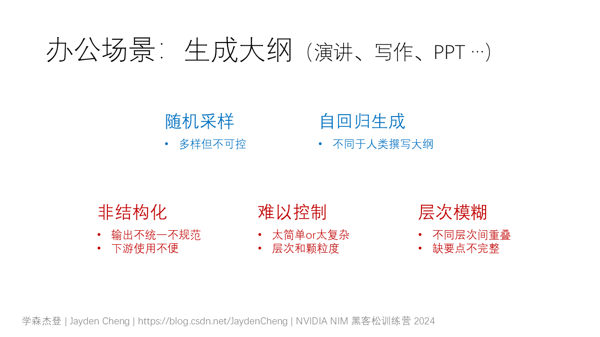
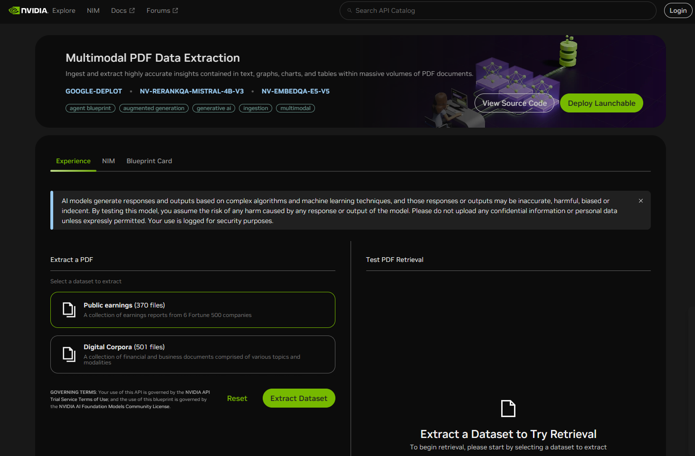
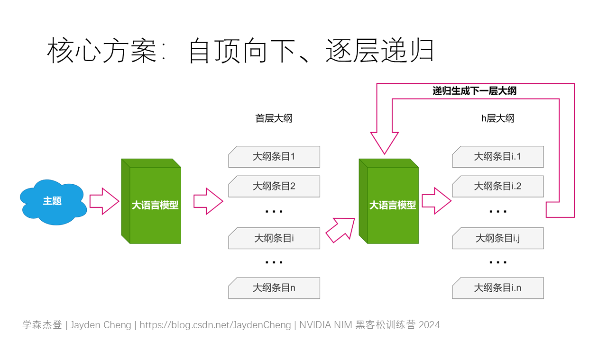
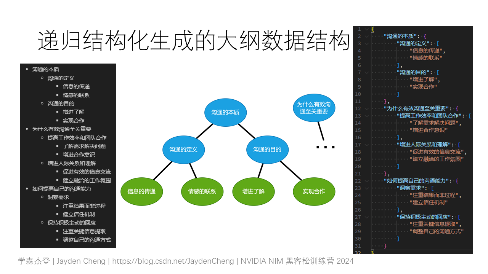
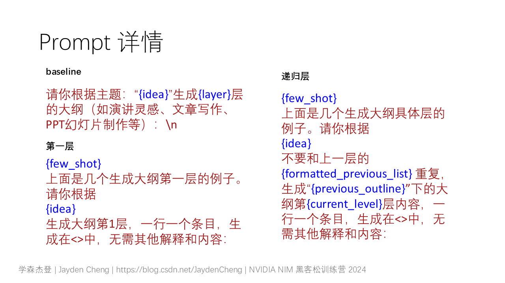
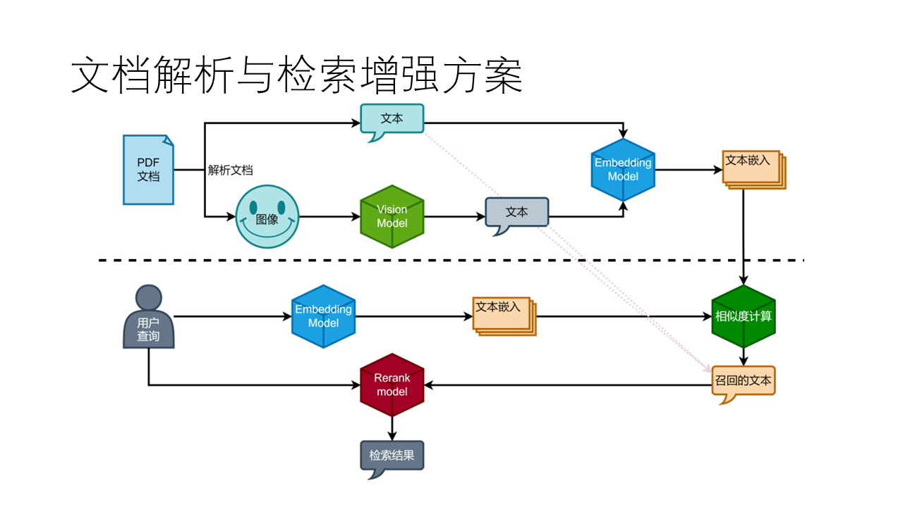
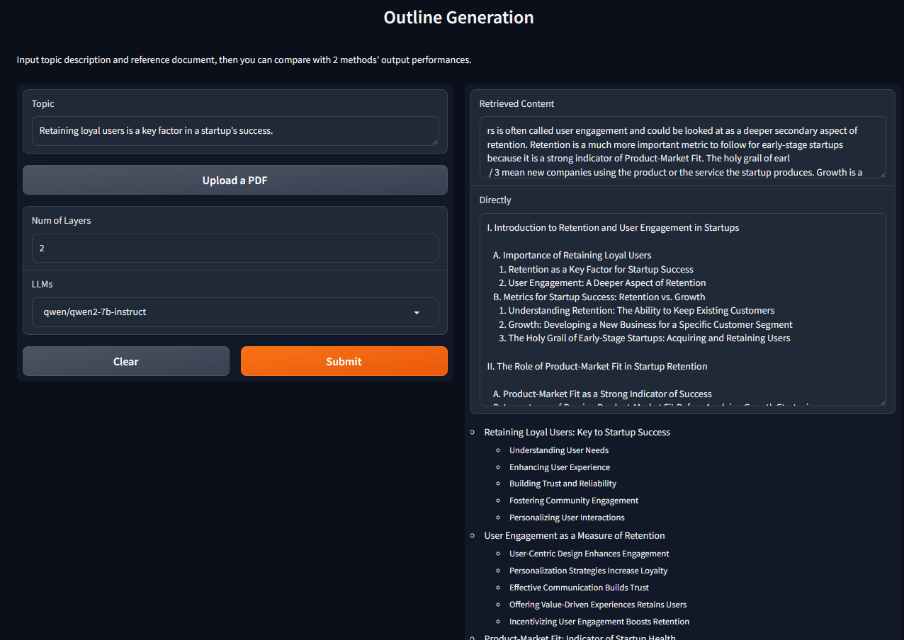

# 【NVIDIA NIM 黑客松训练营】优化LLM生成大纲：递归结构化和检索增强生成

## TL;DR

> 本文介绍了一个利用大语言模型生成PPT大纲的项目，通过递归结构化生成方法解决了传统生成方式存在的非结构化、层次不清等问题。项目基于NVIDIA NIM平台，结合了文档解析与检索增强技术，以提供更精准、结构化的大纲内容。该方法使得生成的大纲层次分明、内容具体，便于用户和下游任务直接使用。

项目实现了给定“主题”和“参考PDF”：

1. 检索增强：解析、提取、转换“参考PDF”，并根据“主题”在“参考PDF”中检索出“参考信息”；
2. 递归结构化生成：将“主题”和“参考信息”递归地提交给大模型，生成结构化大纲数据。

本项目的AI能力均在 NVIDIA NIM 平台上实现，并在项目的检索增强部分使用和参考 NIM Agent Blueprint 的模型和架构实现。参考的 Blueprint：[https://build.nvidia.com/nvidia/multimodal-pdf-data-extraction-for-enterprise-rag]

项目代码：[https://github.com/realJaydenCheng/nvidia-nim-demo]

## 项目简介

给定主题和参考信息，生成大纲（如演讲灵感、文章写作、PPT幻灯片制作等）是大语言模型在办公场景下常见应用需求。

然而由于

1. 大模型为了保证输出不局限于一种形式，在生成过程中存在随机采样，生成的内容和格式不可控；
2. 大模型是基于自回归的，在生成有复杂层次的大纲时上层大纲并没有生成完就生成下层内容，和人类规划大纲自顶向下的方法不同。



会导致直接让大模型生成大纲存在不限于以下的问题：

- 输出的内容是非结构化的，输出格式多样，难以统一和规范，生成的大纲后续的分析与利用变得复杂；
- 生成过程中的层级深度和每层的颗粒度无法灵活控制，导致生成内容有时过于简单，有时又过于复杂，缺乏可控性；
- 大纲的层级之间往往存在模糊和重叠，无法有效传达不同层次的重点内容；

为了解决上述问题，本文提出了一种递归结构化生成的方法。本方法通过分层递归控制大模型生成大纲的过程，自顶向下，不仅能使大纲结构清晰，使输出结果便于下游任务使用，而且可以灵活控制各层的深度和颗粒度。这样生成的大纲不仅层次分明，内容也更加贴合实际应用需求，避免了层级模糊和内容重叠的现象。

本项目基于 NVIDIA NIM 平台，使用 LLaMA/Qwen/mistral 等作为基座模型，采用 gradio 构建示例用户图形界面。NVIDIA NIM 平台提供了强大的自然语言处理等人工智能能力，能够方便、高效地调用各种预训练模型，甚至进行定制化的推理。



此外，为了让大模型更好地生成选题，并让模型有更多信息用于参考，不局限于自己的先验知识，本项目还使用 “Multimodal PDF Data Extraction” 这个 NIM Agent Blueprint 中的模型，构建了一套 PDF 文档解析和构造子模块。这个模块可以提取出文档中的文本和图像，并将图像转换为可检索的文本，然后将上述所有文本分块嵌入到向量空间中存储。在得到嵌入的文档后，该模块还可以实现简单的文本块检索，包括相似度计算、召回、精排等步骤，找出和 query 最相关的文本块。

在检索增强模块中：使用 pymupdf python 包的 fitz 模块解析和抽取 PDF 文件。使用 vision 版的 llama 将图像转换为文本。使用 `nv-embedqa-e5-v5` 模型将文本块嵌入到向量空间。使用 `nv-rerankqa-mistral-4b-v3` 完成检索结果的精排。

## 递归结构化生成方案

该项目的核心是递归生成指定主题的大纲，先总后分，自顶向下，逐层递进，确保大纲的层次清晰、内容具体，避免生成结果的模糊和重叠问题。核心流程如下：

1. **第一层生成**：首先，通过模型生成第一层的PPT大纲内容，确保初始大纲框架具有明确的层次。
2. **递归生成**：在生成初始层之后，递归生成每个子级的内容，逐层递进。每一级的生成都是基于上一层的大纲内容进行细化和补充，保证了层次结构的清晰和逻辑性。
3. **递归终止条件**：当生成到达指定的层级时，递归终止，输出完整的结构化大纲。

Prompts 是生成式任务方案的重要组成部分，本项目中 Prompts 是用了基本的指令和 few-shot 方案。



### 第一层大纲生成 (`generate_first_level_outlines`)

这个函数负责生成大纲的第一层内容，基于用户输入的主题调用大模型生成初始的大纲框架。第一层大纲的生成比较特殊，与后续层次大纲生成有所不同，第一层生成时不存在前一层的信息，故有着单独的实现。

```python
def generate_first_level_outlines(idea: str, model_name: str):
    first_level_prompt = FIRST_LEVEL_TEMPLATE.format(
        few_shot=FIRST_LEVEL_EXAMPLES,
        idea=idea,
    )
    return extract_outlines(
        request_model_for_one_response(model_name, first_level_prompt)
    )
```

为了简化对模型调用的方式，本项目对大模型的请求简化成一条文本输入对应一条文本输出的函数，抽象成`request_model_for_one_response`方法。

得到模型的输出文本后，通过`extract_outlines`函数处理生成结果，去掉不必要的空白行，得到大纲的第一层结构化内容（即一个字符串列表）。

上面两个工具函数的详情见下一节“实现细节”。

### 递归生成下一级大纲 (`generate_next_level_outline`)

当生成了第一层的大纲后，系统将递归生成各个子级内容。`generate_next_level_outline`函数根据全局和上一层的大纲的信息，生成当前层的细化内容。

模型生成后，如果当前层级达到了目标层（target_layer），则返回当前层的大纲内容。否则，函数将继续递归调用自己，为每个子项生成更深层的大纲内容，直到达到目标层。

```python
def generate_next_level_outline(
    idea: str,
    current_level: int,
    previous_outline: str,
    previous_list: list[str],
    target_layer: int,
    model_name: str,
) -> list[str] | dict:
    formatted_previous_list = ', '.join(previous_list)
    next_level_prompt = NEXT_LEVEL_TEMPLATE.format(
        few_shot=NEXT_LEVEL_EXAMPLES,
        idea=idea,
        formatted_previous_list=formatted_previous_list,
        previous_outline=previous_outline,
        current_level=current_level,
    )
    outlines = extract_outlines(
        request_model_for_one_response(model_name, next_level_prompt)
    )

    if target_layer == current_level:
        return outlines
    else:
        return {
            text: generate_next_level_outline(
                idea, current_level + 1, text,
                outlines, target_layer, model_name
            ) for text in outlines
        }
```

注意，prompt 中会将上一级的内容和当前的层次信息整合，让模型有更充分的信息生成该层的大纲内容。

### 递归结构化大纲生成(`recursive_outline`)与大纲数据结构

这个函数是整个递归生成过程的整合，通过逐层调用`generate_next_level_outline`函数，生成每一层的大纲，直到生成目标层的所有内容。

```python
def recursive_outline(idea: str, target_layer: int, model_name: str,):
    first_level = generate_first_level_outlines(idea, model_name)
    return {
        text: generate_next_level_outline(
            idea, 2, text, first_level, target_layer, model_name
        ) for text in first_level
    }
```

最终生成的大纲是一个具有树状结构的嵌套 dict 数据结构。所有的大纲条目文本均是这个树状结构的一个节点。同一个双亲节点下的叶子节点的大纲条目将存储在一个 list 中，非叶子节点的大纲条目都是 dict 中的键，其子节点将存储在后续的 dict 或 list 中。



### Prompts

本项目的 Prompt 明确告知模型生成PPT大纲的任务，提供主题信息（idea）和所需层级（layer），确保模型能够聚焦于特定主题，并生成相应层次的内容。此外，通过提供多个生成示例（few-shot），向模型展示了预期的输出格式和内容结构，并提供了明确的上下文，帮助模型更好地生成和避免生成重叠和模糊地内容。



这里使用的是中文示意图，代码中实际为英文提示词。

### 获取模型响应(`request_model_for_one_response`)

本项目中对模型的调用需求比较简单，仅期望模型根据输入返回一条文本输出，故将所有的相关重复操作（配置、请求、提取）打包到一个函数中，简化调用流程：

```python
def request_model_for_one_response(
    model_name: str,
    prompt: str,
):
    response = CLIENT.chat.completions.create(
        model=model_name,
        messages=[{"role": "user", "content": prompt}],
        temperature=0.3,
        max_tokens=1024,
    )
    return response.choices[0].message.content.strip()
```

### 大纲文本提取(`extract_outlines`)

这里实现的是一个简单的提取方法，将模型输出按行分割并去除空白行和格式字符。

```python
def extract_outlines(model_output: str):
    return [
        line.strip().strip('<').strip('>')
        for line in model_output.split('\n')
        if line.strip()
    ]
```

### baseline 对比、全局变量和简易用户界面

大纲生成的基本过程通过调用 NVIDIA NIM 平台的接口，将主题与层级信息传入模型生成器，控制输出大纲的层级深度和层次内容。复现时需要更换`NVIDIA_API_KEY`变量。

简易的 web 用户界面是基于 gradio 构建的。用户只需输入主题和层数，根据喜好选择基座模型，项目就可以生成两个版本的PPT大纲，一个是直接生成的，一个是递归生成的，并将两者进行对比展示。

递归生成的大纲是结构化的，因此可以更好地在各种场景下和终端中展示。以本项目的此 demo 为例，最终展示是 gradio 构建的。因此，本 demo 将结构化的数据转换为 markdown 格式的字符串，借助 gradio 的 markdown 的渲染能力更清晰地展示生成效果。

```python
def generate_outline(
    input_text: str,
    layer: int,
    model_name: str,
):
    prompt = BASE_TEMPLATE.format(idea=input_text, layer=layer)
    return request_model_for_one_response(model_name, prompt)


def dict_to_markdown(data: dict, indent=0):
    markdown_lines = []
    for key, value in data.items():
        markdown_lines.append('  ' * indent + f'- {key}')
        if isinstance(value, dict):
            markdown_lines.append(dict_to_markdown(value, indent + 1))
        elif isinstance(value, list):
            markdown_lines.extend([
                '  ' * (indent + 1) + f'- {item}'
                for item in value
            ])
    return '\n'.join(markdown_lines)


def compare_outlines(input_text: str, layers: float, model_name: str):
    direct = generate_outline(input_text, int(layers), model_name)
    recursive = recursive_outline(input_text, int(layers), model_name)
    return direct, dict_to_markdown(recursive)
```

## 文档解析与检索增强方案

本项目中，为了给大模型提供充足且有效的信息，加入了文档解析和检索增强部分。这一部分的业务场景是针对一个文档的输入的。对于输入的文档，其解析核心处理流程是：

1. **解析文档**：将文档中的文本和符合条件的图像解析并抽取出来，存储备用；
2. **转换图像**：将图像转换成对图像的描述文本；
3. **嵌入文本**：将文档中所有文本切分成块，并转换为嵌入向量，用于后续检索。

在完成文档解析后，需要从中检索出和用户输入主题最相关信息。这一部分的核心流程是：

1. **相似度计算**：将用户主题文本嵌入成向量，使用这个向量与所有文档分块的嵌入向量计算相似度；
2. **召回**：设定一个最高阈值，大于这个阈值的文档分块进入下一步骤，如果符合要求的分块不足，则降低阈值重复此步骤；
3. **精排**：将召回得到的文档分块和用户的输入文本一一比对，精确对比和调整相似度和对比相关关系。



### 解析文档（`IngestedDoc`）

本部分实现了 `IngestedDoc` 类，负责从 PDF 文档中提取文本和图像信息，为后续检索和其他处理提供基础。`IngestedDoc` 类的设计是为了处理来自PDF文件的原始数据流，执行文档解析、文本与图像信息的提取以及文本块的嵌入转换等任务。

```python
class IngestedDoc:

    def __init__(self, pdf_content: BytesIO) -> None:
        self.input = pdf_content
        self.file = fitz.open(stream=self.input)
        self._parse_pdf()
        self._gen_full_text()
        self._chunk_and_embedding()

    def retrieve(...): ...

    def _chunk_and_embedding(self):
        self.chunked_text = chunk_text(self.full_text)
        self.embeddings = np.array(
            text_to_embd(self.chunked_text, "passage")
        )

    def _parse_pdf(self):
        self.text = "\n".join([
            page.get_text() for page in self.file
        ])
        self.images = extract_images_from_pdf(self.file)

    def _gen_full_text(self):
        img_text_ls = [
            img_to_text(img)
            for img in self.images
        ]
        self.full_text = self.text + "\n" + "\n".join(img_text_ls)
```

`_parse_pdf` 该方法使用 pymupdf 库中的 fitz 模块来打开并解析PDF文件，从中提取每一页的纯文本内容和图像。这些信息将分别存储在实例变量 `self.text` 和 `self.images` 中，为后续处理准备数据。
在完成了基本的文档解析之后，`_gen_full_text`方法会进一步处理提取到的图像，使用预定义的 `img_to_text` 函数将图像转换为描述性的文本，并将其与已有的文本内容合并，形成完整的文档文本内容 `self.full_text`。
`_chunk_and_embedding` 方法首先将合并后的全文本分割成多个较小的文本块，以适应后续的嵌入转换。接着，使用指定的嵌入模型（如`nv-embedqa-e5-v5`）将这些文本块转换为向量形式，存储在 `self.embeddings` 中，便于后续的相似度计算和检索操作。

### 转换图像（`extract_images_from_pdf`）

`extract_images_from_pdf` 的主要目的是从给定的 PDF 文档中提取出符合条件的图像，并将这些图像以二进制流的形式存储在一个列表中。这里的“符合条件”指的是图像的尺寸、颜色空间、以及图像与像素图的比例等因素都满足一定的标准，以保证提取出来的图像既有足够的信息量，又不会过于冗余。

本功能实现参考和改编了公开的 PyMuPDF 提取图像示例，详见：[https://github.com/pymupdf/PyMuPDF-Utilities/blob/master/examples/extract-images/extract-from-xref.py]

### 嵌入文本(`chunk_text`与`text_to_embd`)

在文档解析与检索增强方案中，文本嵌入是将文档中的文本信息转换为机器学习模型能够理解和处理的数字向量的过程。这一过程不仅能够保留文本的语义信息，还能为后续的相似度计算、信息检索等操作提供基础。

```python
def chunk_text(
    text: str,
    chunk_size: int = 256,
    overlap: int = 64,
):
    clean_text = re.sub(r'[\s\n]+', ' ', text, flags=re.S).strip()
    chunked = [
        clean_text[i:i + chunk_size]
        for i in range(0, len(text), chunk_size - overlap)
    ]
    return [
        chunk for chunk in chunked
        if re.sub(r'[\s\n]+', '', chunk, flags=re.S).strip()
    ]
```

`chunk_text` 函数的主要任务是将一段较长的文本切分为多个较短的文本块，以便于后续的嵌入转换和信息处理。首先清理文本，使用正则表达式去除文本中的多余空格和换行符，确保每个文本块的内部结构更加紧凑。接着根据 `chunk_size` 和 `overlap` 参数，将清理后的文本按指定的步长和重叠长度切分为多个文本块。步长为 `chunk_size - overlap`，确保相邻文本块之间有一定的重叠，从而避免信息的丢失。然后再次使用正则表达式去除每个文本块中的空白字符，确保最终返回的文本块中没有空或只有空白字符的块，最终返回一个包含所有非空白文本块的列表。

```python
def text_to_embd(
    text: list[str],
    type: Literal["query", "passage"] = "passage",
    batch_size: int = 128,
):
    client = OpenAI(
        api_key=NVIDIA_API_KEY,
        base_url="https://integrate.api.nvidia.com/v1"
    )

    result = []
    for i in range(0, len(text), batch_size):
        result.extend(text_to_embd_one_batch(
            text[i:i + batch_size], type, client
        ))
    return result
```

`text_to_embd` 函数的主要任务是将文本块转换为嵌入向量。在初始化 OpenAI 客户端后，为了提高处理效率，函数将文本块按 `batch_size` 分批处理。对于每一批文本块，调用 `text_to_embd_one_batch` 函数获取其嵌入向量。`text_to_embd_one_batch` 函数负责与嵌入模型进行实际的交互，将一批文本块转换为嵌入向量。最后将所有批次的嵌入向量合并为一个列表，并返回。

```python
def text_to_embd_one_batch(
    text: list[str],
    type: Literal["query", "passage"],
    client: OpenAI
):
    response = client.embeddings.create(
        input=text,
        model="nvidia/nv-embedqa-e5-v5",
        encoding_format="float",
        extra_body={"input_type": type, "truncate": "NONE"}
    )

    return [
        obj.embedding for obj in response.data
    ]

```

### 相似度计算与召回（`recall_passages`）

整个检索的过成定义在 `IngestedDoc` 类中：

```python
class IngestedDoc:
    ...
    def retrieve(
        self,
        query: str,
        top_k=5,
        max_threshold: float = 0.8,
    ):
        recalled_indices = recall_passages(
            query, self.embeddings,
            max_threshold, top_k
        )
        recalled_chunks = [self.chunked_text[i] for i in recalled_indices]
        ranked_indices = rank_passages(query, recalled_chunks)
        return [
            recalled_chunks[i]
            for i in ranked_indices[:top_k]
        ]
```

`recall_passages` 的主要任务是在给定的文档分块中，根据用户提供的查询文本，找到与查询文本最相关的文档分块。这一过程包括以下几个关键步骤：查询文本的嵌入转换、相似度计算、召回和阈值调整。通过这些步骤，函数能够高效地从大量文档分块中筛选出最相关的结果。此模块应用于单文档或小规模文档集合的场景，使用 NumPy 计算向量相似度，具有轻量化、易部署的优势。与向量数据库方案相比，该方案适用于对计算效率要求较高且数据规模较小的应用场景，为用户提供快速、准确的召回结果。

```python
def recall_passages(
    query: str,
    chunk_embds: np.ndarray,
    threshold: float,
    top_k: int,
):
    query_embd = text_to_embd([query], "query")
    similarities = np.dot(chunk_embds, query_embd[0])
    indices = np.array([])
    for t in range(int(threshold * 100), 0, -5):
        t = t / 100
        indices = np.where(similarities > t / threshold)[0]
        if len(indices) > top_k:
            break
    return indices
```

将查询文本转换为嵌入后，计算查询文本嵌入向量与所有文档分块嵌入向量之间的点积，得到一个相似度数组 `similarities` 。点积的结果反映了查询文本与每个文档分块之间的相似度。召回部分具体算法如下：

初始化一个空的 `indices` 数组，用于存储相似度大于阈值的文档分块索引。
从初始阈值 `threshold` 开始，逐步降低阈值，每次降低 0.05，直到找到足够数量的文档分块。
在每次调整阈值时，找到相似度大于当前阈值的文档分块索引，并更新 `indices` 数组。
如果在某次调整阈值后找到的文档分块数量超过了 `top_k` ，则停止调整阈值，返回当前的 `indices` 数组。

### 精排（`rank_passages`）

`rank_passages` 函数的对召回的文档分块进行精确排序。精排是为了确保最终返回给模型提供的内容不仅相关度高、信息密度足够，而且尽量占用少的token，降低调用成本的同时避免模型在大量数据中找不着关键信息。这一过程通过调用 NVIDIA 提供的 nv-rerankqa-mistral-4b-v3 模型来实现，该模型能够更精细地评估查询文本与每个文档分块之间的相关性。

```python
def rank_passages(
    query: str,
    passages: list[str],
):
    invoke_url = "https://ai.api.nvidia.com/v1/retrieval/nvidia/nv-rerankqa-mistral-4b-v3/reranking"
    headers = {
        "Authorization": f"Bearer {NVIDIA_API_KEY}",
        "Accept": "application/json",
    }

    payload = {
        "model": "nvidia/nv-rerankqa-mistral-4b-v3",
        "query": {"text": query},
        "passages": [
            {"text": passage}
            for passage in passages
        ]
    }

    session = requests.Session()
    response = session.post(invoke_url, headers=headers, json=payload)
    response.raise_for_status()

    rankings: list[int] = [
        data["index"] for data in response.json()['rankings']
    ]
    return rankings
```

## 项目效果与分析总结

运行后，在浏览器中打开项目前端，输入要生成的主题和期望的层数，上传参考 PDF 文档，可以得到普通方法生成和本方法生成的结果。

结果分析使用的是 [https://ashevat.medium.com/growth-is-a-promise-retention-is-a-promise-kept-839ce317310c] 这篇文章作为参考 PDF，输入的主题是“Retaining loyal users is a key factor in a startup's success.”



如图所示，递归结构化生成的效果不仅结构清晰、方便利用，而且相对于普通方法，生成了正确的层次深度，大纲对于主题的分析更加深入和全面，有更多的信息量和参考价值。

通过采用递归结构化生成的方法，本项目能够有效地解决传统PPT大纲生成中遇到的各种问题，为用户提供更清晰、有条理的内容。希望本项目的实践经验能够为更多相关应用的探索与优化提供启示和借鉴。
